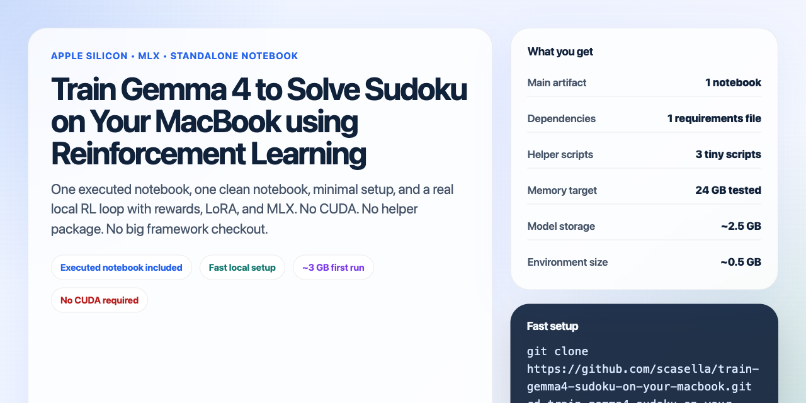

<p align="center">
  
</p>

# Train Gemma 4 to Solve Sudoku on Your MacBook using Reinforcement Learning

<p align="center">
  
  
  
  
  
</p>

One notebook, a small dependency list, and a fast local setup path for running Gemma 4 RL on Apple Silicon with MLX. Clone it, install dependencies, open JupyterLab, and you can inspect or rerun the full reward-definition and training loop locally.

## Credit

This project is an Apple Silicon / MLX adaptation of Unsloth's original Gemma 4 reinforcement learning Sudoku notebook.

- Original Unsloth project: [unslothai/unsloth](https://github.com/unslothai/unsloth)
- Original notebook source: [Gemma4_(E2B)_Reinforcement_Learning_Sudoku_Game.ipynb](https://colab.research.google.com/github/unslothai/notebooks/blob/main/nb/Gemma4_(E2B)_Reinforcement_Learning_Sudoku_Game.ipynb)

Unsloth provided the original RL notebook structure and teaching flow. This repo repackages and optimizes that idea for a minimal, standalone, Mac-friendly MLX workflow.

## Start in 3 Commands

If Gemma 4 access requires authentication, export `HF_TOKEN` first.

```bash
git clone https://github.com/scasella/train-gemma4-sudoku-on-your-macbook.git
cd train-gemma4-sudoku-on-your-macbook
./script/setup_workspace_env.sh && ./script/run_jupyter_lab.sh
```

## What You Get

- One main notebook that already has outputs: [Gemma4_(E2B)_Reinforcement_Learning_Sudoku_Game.ipynb](./Gemma4_(E2B)_Reinforcement_Learning_Sudoku_Game.ipynb)
- One clean notebook with the same content but without baked-in outputs: [Gemma4_(E2B)_Reinforcement_Learning_Sudoku_Game_clean.ipynb](./Gemma4_(E2B)_Reinforcement_Learning_Sudoku_Game_clean.ipynb)
- Local Apple Silicon execution with `mlx` and `mlx-lm`
- A fully inline Sudoku environment, reward function definition, code-sandboxing logic, LoRA setup, and GRPO-style training loop
- A minimal setup path: create a venv, install dependencies, open JupyterLab, run the notebook
- No helper Python package, no local training framework, and no pre-existing checkpoint required

## Minimal Setup and Resource Footprint

This repo is optimized for the smallest practical setup surface:

- one notebook as the main artifact
- one `requirements.txt`
- three tiny helper scripts
- no Docker
- no CUDA
- no extra local package to install from this repo

Typical first-run local artifacts are modest for a real Gemma 4 example:

- Python environment: roughly `0.5 GB`
- Converted MLX model: roughly `2.5 GB`
- Notebook files and repo content: well under `1 MB`
- Peak active RAM during notebook execution on an M4 Pro: about `6.3 GiB`

The notebook was verified on an Apple Silicon MacBook Pro with `24 GB` unified memory, and the setup path is intentionally kept small and direct.

Measured notebook-process peaks on that machine:

- Fresh first run: `6.37 GiB` RSS peak
- Warm rerun: `6.29 GiB` RSS peak

So the practical expectation is roughly `6.3 GiB` peak unified memory for the notebook process itself.

Then open:

`http://127.0.0.1:8888/lab`

If `8888` is busy:

```bash
./script/run_jupyter_lab.sh 8890
```

## Fastest Path

Open the default notebook:

- [Gemma4_(E2B)_Reinforcement_Learning_Sudoku_Game.ipynb](./Gemma4_(E2B)_Reinforcement_Learning_Sudoku_Game.ipynb)

Why this is the default:

- it already contains executed outputs
- newcomers can see the whole flow before they run anything
- the filename stays clean for sharing, linking, and GitHub previews
- it gives the fastest path from clone to understanding

If you want the exact same notebook without stored outputs, use:

- [Gemma4_(E2B)_Reinforcement_Learning_Sudoku_Game_clean.ipynb](./Gemma4_(E2B)_Reinforcement_Learning_Sudoku_Game_clean.ipynb)

## What Happens on First Run

- Python packages are installed into `.venv/`
- the notebook downloads and converts Gemma 4 into `models/`
- training outputs are written under `outputs/`

Nothing in this repo depends on a local helper package or a pre-existing checkpoint.

## Headless Check

```bash
./script/setup_workspace_env.sh
./script/execute_notebook.sh
```

This writes:

- `Gemma4_(E2B)_Reinforcement_Learning_Sudoku_Game.rerun.ipynb`

## What To Expect

- The notebook defines the reward functions inline.
- The notebook trains locally with LoRA adapters on MLX.
- The default run is tuned to stay practical on a laptop.
- The final saved policy is selected conservatively so a tiny RL run does not silently end worse than its warm start.
- The repo is meant to be discoverable, approachable, and fast to try.

## Publish Notes

Suggested GitHub metadata is in [GITHUB_METADATA.md](./GITHUB_METADATA.md).
